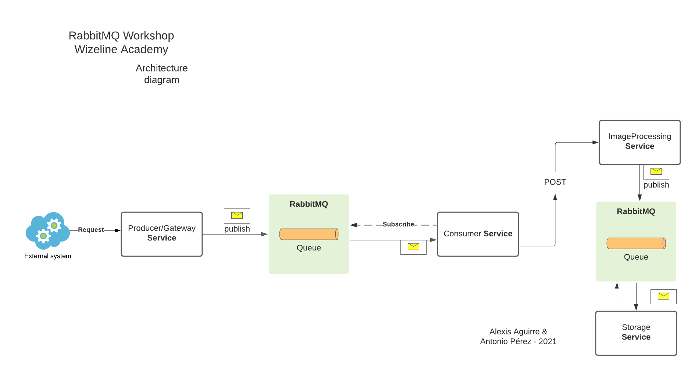

# RabbitMQ-crash-course

## Introduction

Thank you for taking the RabbitMQ crash course. 

## Prerequisites

To have the best experience during this Workshop, make sure to
* Install [Go(lang)](https://golang.org/dl/) v1.15 or above
* Install [Docker](https://docs.docker.com/docker-for-mac/install/)
* Pull RabbitMQ image `docker pull rabbitmq:3-management`
* Follow [Producer](./producer/README.md) and [Consumer](./consumer/README.md) instructions **Before the workshop**


## Getting Started

We're ready to start, you can follow the next steps:

1. Fork this project
2. Start a RabbitMQ server
```
docker run -it --rm --name rabbitmq -p 5672:5672 -p 15672:15672 rabbitmq:3-management
```
3. Enjoy the workshop 🥳
4. [Optional] Start a shell in the container
```
docker exec -it rabbitmq /bin/bash
```

## Project architecture

In this workshop, we will develop a system with the following architecture


## Branches

The project is divided in three sections (branches) which contain distinct steps of the implementation

- main / final-project: the finished project. Implements fault tolerance
- skeleton : project skeleton. The basic project, only implements reading from a queue
- mid-project: the mid step of the project. implements dead letter queues and parking queues