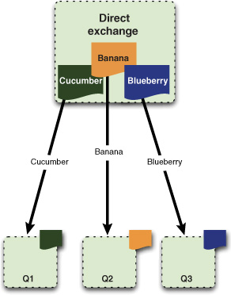
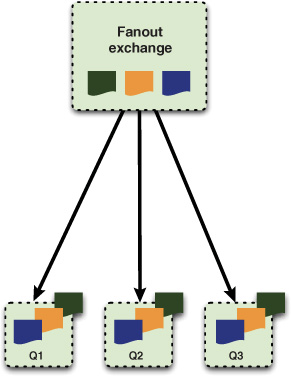
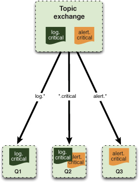
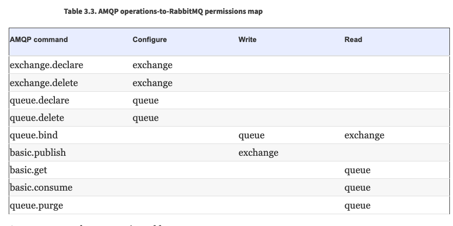
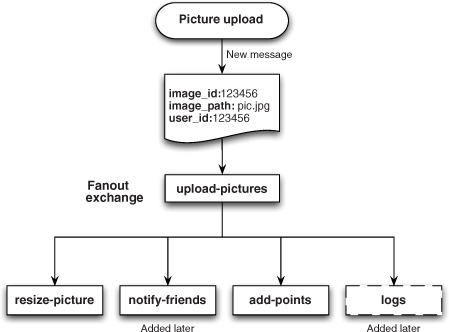
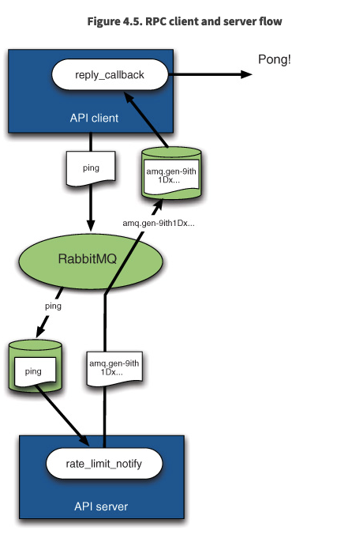

RabbitMQ is an open source message broker and queueing server that can be used to let disparate 


decoupling the communication protocol

You can use Rabbit queues to store jobs and let the broker perform the load balancing and job distribution for you


*Message queuing* is simply connecting your applications together with messages that are routed between them by a message broker like RabbitMQ.


1983 Vivek Ranadivé envisioned a common bus like the one on a motherboard, only this would be a software bus that applications         could plug into


2004 -2006, JPMorgan. *Advanced Message Queuing Protocol (AMQP)* 


Message Queueing


PubSub


https://medium.com/better-programming/rabbitmq-vs-kafka-1ef22a041793

RabbitMQ focus on app-to-app messaging

Forget client/server

Consumer and producers


A message has two parts: a payload         and a label.

A channel is open on top of TCP connection, it is virtual connection, unique ID assigned to it

As each         thread spins up, it creates a channel on the existing connection and gets its own private communication path to Rabbit


1. Message_A arrives in the seed_bin queue.
2. RabbitMQ sends Message_A to Farmer Bob.
3. Farmer Bob acknowledges receipt of Message_A.
4. RabbitMQ removes Message_A from the seed_bin queue.
5. Message_B arrives in the seed_bin queue.
6. RabbitMQ sends Message_B to Farmer Esmeralda.
7. Farmer Esmeralda acknowledges receipt of Message_B.
8. RabbitMQ removes Message_B from the seed_bin queue.


On the other hand, if your consumer app has a bug and forgets         to acknowledge a message, Rabbit won’t send the consumer any  more messages. This is because Rabbit considers the consumer         not ready to receive another message until it acknowledges the  last one it received


This will keep Rabbit from overloading you with more messages than your app can handle.      


What if you want to specifically reject a message rather than acknowledge it after you’ve received it? For example, let’s         say that when processing the message you encounter an uncorrectable error

1. Have your consumer disconnect from the RabbitMQ server. connecting and disconnecting of your consumer (a potentially significant            load if your consumer is encountering errors on every message).         All versions
2. RabbitMQ >= 2.0 basic.reject. Requeue parameter


To create a queue, consumer and producer => queue.declare . Consumers can not declare in a channel subscribed to a queue, they must unsuscribed (transmit mode)

- exclusive—When set to true, your queue becomes private and can only be consumed by your app. This is useful when you need to limit            a queue to only one consumer.         
- auto-delete—The queue is automatically deleted when the last consumer unsubscribes. If  you need a temporary queue used only by one consumer,            combine auto-delete with exclusive. When the consumer disconnects, the queue will be removed.         


Producer -> Exchange area -> Queue -> Consumer



```
$channel->basic_publish($msg, '', 'queue-name');
```


when a user uploads a new picture,         the user’s own image gallery cache must be cleared and also they should be rewarded with some points




##### Figure 2.6. Topic exchange message flow      

```
$channel->basic_publish($msg, 'logs-exchange', 'error.msg-inbox');
```



Three behaviours

1. Queue Server
2. Publish/Subscribe setup
3. RPC server


- The key components in the AMQP architecture are exchanges, queues, and bindings.
- You bind queues to exchanges based on binding rules.
- Messages are sent to exchanges.
- There are three exchange types: direct, fanout, and topic.
- Based on the message routing key and the exchange type, the broker will decide to which queue it has to deliver the message.


**Vhosts** allow security, avoid naming conflicts, different queues

Default vhost, user: guest, password: guest 

They allow fast portability to different servers


So, for a message that’s in flight inside Rabbit to survive a crash, the message must      

- Have its delivery mode option set to 2 (persistent)
- Be published into a durable exchange
- Arrive in a durable queue

**Transactions**, from the producher to the broker, ensure it has been writing on disks

In AMQP, after you place a channel into transaction mode

Though transactions are a part of the formal AMQP 0-9-1 specification,  they have an Achilles heel in that they’re huge drains         on Rabbit performance. Not only can using transactions drop  your message throughput by a factor of 2–10x, but they also make         your producer app synchronous, which is one of the things  you’re trying to get rid of with messaging


 **Publisher confirms**

channel into confirm mode. you can’t turn it off without         re-creating the channel. The major benefit of publisher confirms is that they’re         asynchronous. Once a message has been published, the producer  app can go on to the next message while waiting for the confirm.


**Create users**

```
rabbitmqctl add_user cashing-tier cashMePass
```

or delete

```
rabbitmqctl delete_user cashing-tier 
```

list

```
rabbitmqctl list_users
```

change password

```
rabbitmqctl change_password cashing-tier compl3xPass
```

set *permissions*



```
rabbitmqctl set_permissions --vhost oak cashing-tier ".*" ".*" ".*"
```


- ".*" to match any queue or exchange         
- "checks-.*" to match only queues and exchanges starting with *checks-*
- "" to match *no* queues or exchanges (this is how you deny a specific permission type to a user)         

```
rabbitmqctl set_permissions --vhost oak cashing-tier "" "checks-.*" ".*"
```


**Lists queues**

```
rabbitmqctl list_queues --vhost glass durable auto_delete name 
```


**List exchanges**

```
rabbitmqctl -p glass list_exchanges
```

**List bindings**

```
rabbitmqctl -p glass list_bindings
```


## Use cases - Examples

Seems to scenarios

1. How do you take a time-intensive task and move it out of the app that  triggers it (thereby freeing that app to service other         requests)?
2.  how do you glue together applications written  in different languages like PHP and Erlang so that they act         as a single system? 

But in common 

1. Decoupling the request from the action, moving from a synchronous programming model to an asynchronous one.

Take a look

1. You may think “my app needs to schedule a Chihuahua appointment.” 
2. **Instead  the reality is**, 
   1. your app needs to receive a scheduling request; 
   2. then it needs  to store that request in a database;
   3. then it has to alert the closest dog walker;
   4. and finally it needs to let the customer know they’re scheduled. 

Another one, **paralling processes**

* You can see that resizing a picture
* rewarding the user
* and notifying friends are three separate tasks

The fanout exchange, will put a copy of the message into the bound queues, it will ensure each consumer gets a copy of the message




**Finally RPC (SOAP, REST, ...)**




